# CLAUDE.md - AI Assistant Guide

> **Repository**: 计划李的个人博客 (Personal Blog)
> **Last Updated**: 2025-11-20
> **Purpose**: Comprehensive guide for AI assistants working with this codebase

---

## 📋 Table of Contents

1. [Repository Overview](#repository-overview)
2. [Technology Stack](#technology-stack)
3. [Project Structure](#project-structure)
4. [Development Workflows](#development-workflows)
5. [Content Management](#content-management)
6. [Code Conventions](#code-conventions)
7. [Deployment](#deployment)
8. [Key Files Reference](#key-files-reference)
9. [Common Tasks](#common-tasks)
10. [Important Constraints](#important-constraints)

---

## 🎯 Repository Overview

This is a **Notion-powered static blog** built with pure HTML/CSS/JavaScript. The content is authored in Notion and automatically synchronized to GitHub via a Python script running in GitHub Actions.

### Core Characteristics

- **Static Site**: No build process, pure HTML/CSS/JS
- **Automated Content Pipeline**: Notion Database → Python Script → GitHub → Cloudflare Pages
- **Chinese Language**: All content and UI in Simplified Chinese (zh-CN)
- **Modern Design**: Dark theme with gradient effects and smooth animations
- **Responsive**: Mobile-first design approach

### Owner Information

- **Author**: 计划李 (Ji Hua Li)
- **Background**: Former government employee, GCDF certified career counselor, AI tools explorer
- **Content Focus**: Career development, AI applications, investment thinking, personal growth
- **Zhihu**: [@计划李](https://www.zhihu.com/people/ji-hua-li)

---

## 💻 Technology Stack

### Frontend (Pure Static)

```
HTML5          - Semantic markup, Chinese language
CSS3           - CSS Variables, Flexbox, Grid, Animations
JavaScript     - Vanilla ES6+ (no frameworks/libraries)
```

### Backend/Automation

```
Python 3.10    - Notion sync script
Notion API     - Content source (OAuth Bearer Token)
GitHub Actions - CI/CD automation (daily cron + manual triggers)
```

### Deployment

```
Cloudflare Pages  - Static site hosting
GitHub            - Repository hosting and version control
```

### Dependencies

```python
# requirements.txt
requests==2.31.0  # Only dependency for Notion API calls
```

---

## 📁 Project Structure

```
personal-blog/
├── index.html                    # Homepage with hero section and featured articles
├── blog.html                     # Blog listing with search/filter functionality
├── about.html                    # About page with personal introduction
│
├── [23 article HTML files]       # Auto-generated from Notion
│   ├── ai-career-tools.html
│   ├── breaking-decision-paralysis-with-ai.html
│   ├── claude-skills-deep-dive.html
│   └── ... (20 more articles)
│
├── styles/                       # CSS architecture (1,055 total lines)
│   ├── main.css      (352 lines) # Global styles, CSS variables, navigation, buttons
│   ├── article.css   (297 lines) # Article page typography, code blocks, layout
│   ├── blog.css      (169 lines) # Blog grid, category filters, search UI
│   └── about.css     (237 lines) # About page hero, content styling
│
├── scripts/                      # JavaScript functionality
│   ├── main.js                   # Homepage: typing effect, animations, smooth scroll
│   └── blog.js                   # Blog: search, category filtering
│
├── .github/
│   └── workflows/
│       └── sync-notion.yml       # GitHub Actions workflow (daily sync)
│
├── sync_notion.py                # Notion→HTML conversion script (400 lines)
├── requirements.txt              # Python dependencies
├── README.md                     # Chinese documentation
└── CLAUDE.md                     # This file
```

### Repository Statistics

- **Total Size**: 431 KB
- **Total Commits**: 17+
- **Articles Published**: 23
- **CSS Lines**: 1,055
- **Python Script**: 400 lines

---

## 🔄 Development Workflows

### Automated Content Pipeline

```mermaid
graph LR
    A[Author writes in Notion] --> B[Sets properties]
    B --> C[Checks '已发布' box]
    C --> D[GitHub Actions triggers]
    D --> E[sync_notion.py runs]
    E --> F[Generates HTML files]
    F --> G[Git commit & push]
    G --> H[Cloudflare Pages deploys]
```



### GitHub Actions Workflow

**Triggers:**
1. **Daily Cron**: Every day at 00:00 UTC (08:00 Beijing time)
2. **Manual Dispatch**: Can be triggered manually via GitHub UI
3. **Push to Main**: Automatically runs when code is pushed

**Workflow Steps:**

```yaml
1. Checkout code (actions/checkout@v3)
2. Setup Python 3.10 (actions/setup-python@v4)
3. Install dependencies (pip install requests)
4. Run sync_notion.py
   - Uses secrets: NOTION_TOKEN, NOTION_DATABASE_ID
5. Git config and conditional commit
   - Only commits if changes exist
   - Message: "Auto sync from Notion [YYYY-MM-DD HH:MM:SS]"
6. Push to main branch (ad-m/github-push-action)
```

### Content Publishing Workflow

**For Content Authors:**

1. Create/edit article in Notion Database
2. Set required properties:
   - `标题` (Title) - Article title
   - `分类` (Category) - career/ai/investment/personal
   - `发布日期` (Publish Date) - Publication date
   - `摘要` (Excerpt) - Short summary
   - `阅读时间` (Reading Time) - e.g., "5分钟阅读"
   - `URL` - Article slug (kebab-case)
   - `已发布` (Published) - Checkbox (MUST be checked)
3. Wait for daily sync OR manually trigger workflow
4. Changes auto-deploy to Cloudflare Pages

**For Code Changes:**

1. Create branch following convention: `claude/claude-md-[session-id]`
2. Make changes to HTML/CSS/JS files
3. Test locally (open HTML files in browser)
4. Commit with descriptive message
5. Push to branch with `-u origin <branch-name>`
6. Create PR to main branch
7. Merge triggers auto-deployment

---

## 📝 Content Management

### Notion Database Structure

**Required Properties:**

| Property | Type | Description | Example |
|----------|------|-------------|---------|
| 标题 | Title | Article title | "Claude Skills 深度解析" |
| 分类 | Select | Category (4 options) | "AI应用" |
| 发布日期 | Date | Publication date | 2025-11-17 |
| 摘要 | Text | Article excerpt | "本文深度解析..." |
| 阅读时间 | Text | Reading estimate | "7分钟阅读" |
| URL | Text | Article slug | "claude-skills-deep-dive" |
| 已发布 | Checkbox | Published status | ✓ (must be checked) |

### Category Mapping

```python
CATEGORY_MAP = {
    '职业发展': 'career',      # Career development
    'AI应用': 'ai',           # AI applications
    '投资思考': 'investment',  # Investment thinking
    '个人成长': 'personal'     # Personal growth
}
```

### Notion Block Conversion

The `sync_notion.py` script converts Notion blocks to HTML:

| Notion Block | HTML Output | Notes |
|--------------|-------------|-------|
| Paragraph | `<p>` | Supports rich text |
| Heading 1 | `<h2>` | Note: H1→H2 mapping |
| Heading 2 | `<h3>` | H2→H3 mapping |
| Heading 3 | `<h4>` | H3→H4 mapping |
| Bulleted List | `<ul><li>` | Auto-wraps consecutive items |
| Numbered List | `<ol><li>` | Auto-wraps consecutive items |
| Quote | `<blockquote><p>` | Block quotes |
| Code | `<pre><code>` | Code blocks |

**Rich Text Features:**
- **Bold**: `<strong>`
- **Italic**: `<em>`
- **Code**: `<code>`
- **Links**: `<a href>`
- HTML entity escaping for security

### File Naming Convention

Article HTML files use **kebab-case** matching the Notion URL property:

```
Notion URL: "claude-skills-deep-dive"
→ Output: claude-skills-deep-dive.html

Notion URL: "breaking-decision-paralysis-with-ai"
→ Output: breaking-decision-paralysis-with-ai.html
```

---

## 🎨 Code Conventions

### HTML Standards

**Language & Encoding:**
```html
<!DOCTYPE html>
<html lang="zh-CN">
<head>
    <meta charset="UTF-8">
    <meta name="viewport" content="width=device-width, initial-scale=1.0">
```

**Semantic Structure:**
- Use semantic tags: `<nav>`, `<section>`, `<article>`, `<header>`, `<footer>`
- Consistent navigation across all pages
- BEM-like class naming (not strict BEM)

**Common Navigation Template:**
```html
<nav class="nav">
    <div class="container">
        <div class="nav-content">
            <a href="index.html" class="logo">计划李</a>
            <ul class="nav-links">
                <li><a href="index.html">首页</a></li>
                <li><a href="blog.html">文章</a></li>
                <li><a href="about.html">关于</a></li>
            </ul>
        </div>
    </div>
</nav>
```

### CSS Architecture

**CSS Variables (in `styles/main.css`):**

```css
:root {
    /* Colors */
    --bg-primary: #0a0a0a;
    --bg-secondary: #1a1a1a;
    --bg-card: #222222;
    --text-primary: #ffffff;
    --text-secondary: #a0a0a0;
    --accent: #00d4ff;
    --accent-hover: #00b8e6;

    /* Gradients */
    --gradient-1: #00d4ff;  /* Cyan */
    --gradient-2: #7b2ff7;  /* Purple */
    --gradient-3: #f107a3;  /* Magenta */

    /* Spacing System */
    --spacing-xs: 0.5rem;
    --spacing-sm: 1rem;
    --spacing-md: 2rem;
    --spacing-lg: 4rem;
    --spacing-xl: 6rem;

    /* Other */
    --border-radius: 12px;
    --transition: all 0.3s cubic-bezier(0.4, 0, 0.2, 1);
}
```

**Design System:**
- **Container**: `max-width: 1200px` with auto centering
- **Spacing**: Use CSS variables (`var(--spacing-md)`)
- **Transitions**: Use `var(--transition)` for consistency
- **Colors**: Always reference variables, never hardcode

**Font Stack:**
```css
font-family: -apple-system, BlinkMacSystemFont, 'Segoe UI',
             'PingFang SC', 'Hiragino Sans GB',
             'Microsoft YaHei', sans-serif;
```
Optimized for Chinese character rendering.

**Responsive Approach:**
- Mobile-first design
- Breakpoints handled with media queries in each CSS file
- Flexbox and Grid for layouts

### JavaScript Standards

**ES6+ Features:**
- `const` and `let` (no `var`)
- Arrow functions
- Template literals
- Modern DOM methods (`querySelector`, `addEventListener`)
- Event delegation where appropriate

**Code Style:**
```javascript
// DOMContentLoaded wrapper
document.addEventListener('DOMContentLoaded', function() {
    // Event listeners
    document.querySelectorAll('a[href^="#"]').forEach(anchor => {
        anchor.addEventListener('click', function (e) {
            // Handler code
        });
    });

    // Feature implementations
    const element = document.querySelector('.selector');
    if (element) {
        // Check existence before using
    }
});
```

**No Dependencies:**
- Pure vanilla JavaScript only
- No jQuery, React, Vue, etc.
- Keep it simple and performant

### Python Code Standards

**Docstrings:**
```python
def function_name():
    """Brief description of function"""
    # Implementation
```

**Environment Variables:**
```python
NOTION_TOKEN = os.environ.get('NOTION_TOKEN', '')
DATABASE_ID = os.environ.get('NOTION_DATABASE_ID', '')
```

**Error Handling:**
```python
response = requests.post(url, headers=HEADERS, json=payload)
response.raise_for_status()  # Raise on HTTP errors
```

**Code Organization:**
- Constants at top (API config, mappings)
- Helper functions before main logic
- Clear function names describing purpose

---

## 🚀 Deployment

### Cloudflare Pages Configuration

**Settings:**
- **Build command**: Leave empty (pure static site)
- **Build output directory**: `/` (root directory)
- **Environment variables**: None needed (handled in GitHub)

**Auto-Deployment:**
- Triggered automatically on push to `main` branch
- No build step required
- CDN distribution included
- HTTPS enabled by default

### GitHub Secrets

Required secrets in repository settings:

```
NOTION_TOKEN          - Notion Integration OAuth Bearer Token
NOTION_DATABASE_ID    - Notion Database ID (32-char hex)
GITHUB_TOKEN          - Auto-provided by GitHub Actions
```

### Manual Deployment

If needed to deploy manually:
1. Clone repository
2. Upload entire directory to Cloudflare Pages
3. No build configuration needed

---

## 📚 Key Files Reference

### `sync_notion.py` (400 lines)

**Purpose**: Converts Notion database articles to HTML files

**Key Functions:**

| Function | Purpose | Returns |
|----------|---------|---------|
| `query_database()` | Fetch published articles from Notion | List of page objects |
| `get_page_content(page_id)` | Get block content of a page | List of blocks |
| `block_to_html(block)` | Convert Notion block to HTML | HTML string |
| `rich_text_to_html(rich_text)` | Handle rich text formatting | HTML string |
| `generate_article_html(...)` | Create complete article HTML file | HTML string |
| `update_blog_list(articles)` | Update blog.html article grid | None (file I/O) |
| `update_index_featured(articles)` | Update index.html featured articles | None (file I/O) |

**Execution Flow:**
1. Query Notion database for published articles
2. Sort by publication date (descending)
3. For each article:
   - Fetch content blocks
   - Convert blocks to HTML
   - Generate complete HTML file
   - Save to repository root
4. Update `blog.html` with article cards (regex replacement)
5. Update `index.html` with top 3 featured articles
6. Print summary of generated files

### `styles/main.css` (352 lines)

**Sections:**
- CSS Variables and reset (lines 1-35)
- Navigation bar (lines 43-90)
- Hero section (lines 92-150)
- Buttons (lines 152-180)
- Article cards (lines 182-230)
- Footer (lines 232-260)
- Utility classes (lines 262-300)
- Responsive media queries (lines 302-352)

### `scripts/main.js`

**Features:**
- Smooth scrolling for anchor links
- Navigation bar scroll effects (shadow on scroll)
- Article card hover animations (translateY, scale)
- Typing effect for hero text
- Mouse-following gradient (if implemented)

### `scripts/blog.js`

**Features:**
- Category filtering (all/career/ai/investment/personal)
- Real-time search across title, excerpt, and category
- Active state management for filter buttons
- Show/hide articles based on filters

---

## 🛠️ Common Tasks

### Task 1: Add a New Static Page

```bash
# 1. Create new HTML file (copy from existing template)
cp about.html new-page.html

# 2. Update content in new-page.html
# 3. Add CSS if needed in styles/
# 4. Update navigation in ALL HTML files
# 5. Test locally, commit, and push
```

### Task 2: Modify Styles

```bash
# 1. Identify which CSS file:
#    - Global changes → styles/main.css
#    - Article pages → styles/article.css
#    - Blog listing → styles/blog.css
#    - About page → styles/about.css

# 2. Edit CSS file
# 3. Test in browser (refresh)
# 4. Commit and push
```

### Task 3: Update Notion Sync Script

```bash
# 1. Edit sync_notion.py
# 2. Test locally (requires NOTION_TOKEN and NOTION_DATABASE_ID):
export NOTION_TOKEN="secret_xxx"
export NOTION_DATABASE_ID="xxx"
python sync_notion.py

# 3. Verify generated HTML files
# 4. Commit and push
# 5. GitHub Actions will use the updated script
```

### Task 4: Debug Notion Sync Issues

```bash
# Check GitHub Actions logs
# Go to: Actions tab → Latest "Sync from Notion" workflow → View logs

# Common issues:
# - Missing NOTION_TOKEN or NOTION_DATABASE_ID secrets
# - Notion API rate limits
# - Invalid block types (script may need updates)
# - Network errors (auto-retried by Actions)

# Test locally:
python sync_notion.py
# Check console output for errors
```

### Task 5: Add New Category

```python
# 1. Update CATEGORY_MAP in sync_notion.py
CATEGORY_MAP = {
    '职业发展': 'career',
    'AI应用': 'ai',
    '投资思考': 'investment',
    '个人成长': 'personal',
    '新分类': 'new-category'  # Add this line
}

# 2. Add category button in blog.html
<button class="category-btn" data-category="new-category">新分类</button>

# 3. Update blog.js filter logic (should auto-work)
# 4. Commit and push
```

### Task 6: Update Site Metadata

```bash
# Update these sections in ALL HTML files:
# - <title> tags
# - <meta> tags (description, keywords, og:tags)
# - Footer copyright and social links

# Files to update:
# - index.html
# - blog.html
# - about.html
# - All article HTML files (or update template in sync_notion.py)
```

---

## ⚠️ Important Constraints

### DO NOT Modify

**Auto-Generated Files:**
- All article HTML files (e.g., `claude-skills-deep-dive.html`)
  - These are regenerated on every Notion sync
  - Changes will be overwritten
  - Edit content in Notion instead

**Partial Auto-Generated Sections:**
- `blog.html` - Article cards section (between regex markers)
- `index.html` - Featured articles section (between regex markers)
  - Only edit outside these sections
  - Check `sync_notion.py` for exact regex patterns

### ALWAYS Modify

**Template Changes:**
- If you want to change article page structure, edit the template in `sync_notion.py`:
  - Look for `generate_article_html()` function
  - Update the HTML template string
  - Run sync to regenerate all articles

**Safe to Edit:**
- `styles/*.css` - All CSS files
- `scripts/*.js` - All JavaScript files
- `about.html` - Complete file
- `index.html` - Outside featured articles section
- `blog.html` - Outside article cards section

### File Encoding

- All files use UTF-8 encoding
- Essential for Chinese character support
- Always save with UTF-8 (not UTF-8 BOM)

### Git Workflow

**Current Branch:**
- Active: `claude/claude-md-mi6rm89cw18exhi0-01Mz3tXozXjFQg93fdohgJ5q`
- Main branch: `main`

**Branch Naming Convention:**
```
claude/claude-md-[session-id]
```

**Commit Messages:**
- Auto-sync: "Auto sync from Notion [YYYY-MM-DD HH:MM:SS]"
- Manual changes: Descriptive messages in English or Chinese

**Push Commands:**
```bash
# Always use -u flag for first push
git push -u origin claude/claude-md-[session-id]

# Retry on network failures (up to 4 times with exponential backoff)
# 2s, 4s, 8s, 16s delays
```

### Security Considerations

**Never Commit:**
- Notion API tokens
- Database IDs
- Personal API keys
- `.env` files (if created)

**HTML Escaping:**
- `sync_notion.py` escapes HTML entities in content
- Prevents XSS vulnerabilities
- Do not disable escaping

**API Rate Limits:**
- Notion API has rate limits
- GitHub Actions workflow respects limits
- Daily sync is well within limits

---

## 🎯 Quick Reference Checklist

### Before Making Changes

- [ ] Understand if file is auto-generated
- [ ] Check current branch name
- [ ] Review related CSS/JS files
- [ ] Test locally if possible

### After Making Changes

- [ ] Test in browser (multiple screen sizes)
- [ ] Verify Chinese characters render correctly
- [ ] Check navigation works across all pages
- [ ] Commit with clear message
- [ ] Push to correct branch

### When Debugging

- [ ] Check GitHub Actions logs
- [ ] Verify secrets are set correctly
- [ ] Test Notion API connection
- [ ] Check browser console for JS errors
- [ ] Validate HTML structure

---

## 📞 Additional Resources

- **README.md**: Chinese documentation for users
- **GitHub Actions**: `.github/workflows/sync-notion.yml`
- **Notion API Docs**: https://developers.notion.com/
- **Cloudflare Pages Docs**: https://developers.cloudflare.com/pages/

---

**Last Updated**: 2025-11-20
**Maintained By**: AI assistants and repository collaborators
**Version**: 1.0.0
