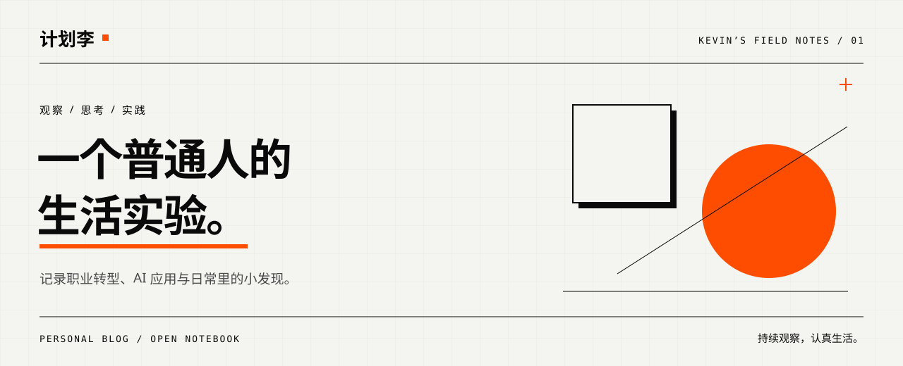
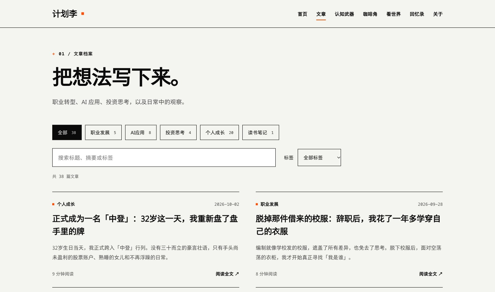
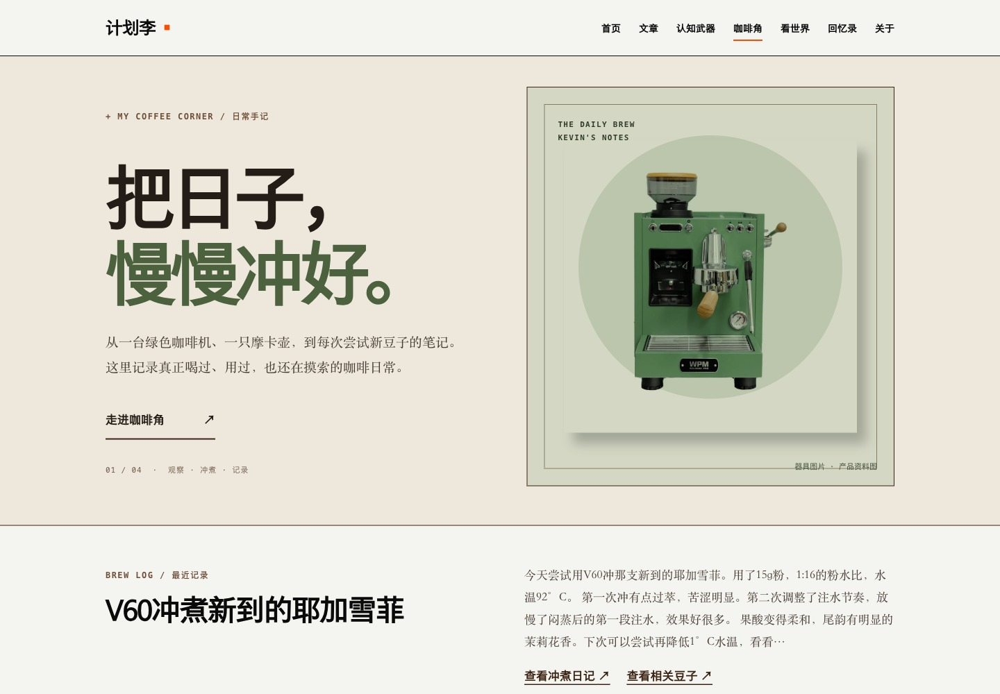
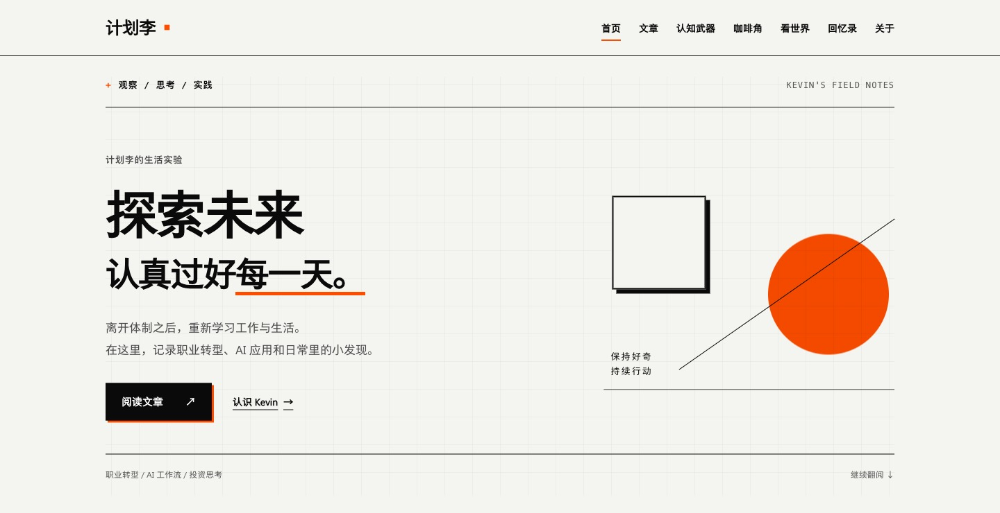
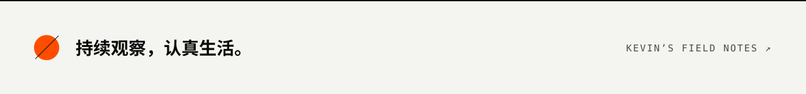

<p align="center">
  
</p>

<p align="center">
  <a href="https://aikevin.dpdns.org/"></a>
</p>

<p align="center">
  <a href="#explore">从这里开始</a> · <a href="#screens">界面一览</a> · <a href="#workflow">内容如何维护</a> · <a href="#boundaries">数据边界</a> · <a href="#develop">本地运行</a>
</p>

# 计划李的生活实验

这里是 Kevin 的个人博客。离开体制之后，重新学习工作与生活，把职业转型、AI 工具的实际使用、投资思考，以及咖啡和旅行中的小发现写下来。

如果你也在探索工作与生活的新可能，可以从一篇文章开始。这个仓库直接使用 HTML、CSS 和原生 JavaScript 维护页面与阅读体验。

<a id="explore"></a>

## 从一个问题，或一杯咖啡开始

<table>
<thead><tr><th width="140">阅读入口</th><th>可以在这里做什么</th></tr></thead>
<tbody>
<tr><td><strong><a href="https://aikevin.dpdns.org/blog.html">文章</a></strong></td><td>按职业发展、AI 应用、投资思考、个人成长、读书笔记浏览；组合分类、标签与关键词筛选，并分享带筛选条件的链接。</td></tr>
<tr><td><strong><a href="https://aikevin.dpdns.org/visual-design.html">认知武器</a></strong></td><td>从拖延、选择困难、沟通和职业方向等具体问题查找 108 个思考工具；搜索模型或原文标题，展开第一步练习，再阅读完整专题。</td></tr>
<tr><td><strong><a href="https://aikevin.dpdns.org/coffee.html">咖啡角</a></strong></td><td>在器具、豆子档案、探店记录与冲煮日记之间切换，从最近一杯回看配方与风味记录。</td></tr>
<tr><td><strong><a href="https://aikevin.dpdns.org/travel.html">看世界</a></strong></td><td>浏览目的地与历史旅行计划，沿路线查看按天整理的行程、住宿和景点详情。</td></tr>
<tr><td><strong><a href="https://aikevin.dpdns.org/gallery.html">回忆录</a></strong></td><td>旅途与日常影像的存放入口，支持相册与标签筛选；当前仓库的静态预览展示待整理状态。</td></tr>
</tbody>
</table>

**阅读路径：** 打开首页 → 选择主题 → 筛选文章或浏览专题 → 进入正文与详情。文章页提供目录导航；手机端使用可展开的导航菜单。

<a id="screens"></a>

## 界面一览

奶油白纸面、黑色硬边框、橙色标记与大留白，让文字和记录站在前面。以下截图来自本分支的真实本地运行界面，线上版本可能随发布进度不同。

### 01 / 找到值得继续读的内容

文章列表把分类、标签与搜索放在一起，筛选结果直接体现在页面中。

[](https://aikevin.dpdns.org/blog.html)

### 02 / 把日常积累成档案

咖啡角从最近的冲煮记录展开，把器具和风味放回日常使用的语境。

[](https://aikevin.dpdns.org/coffee.html)

<details>
<summary>再看一眼首页</summary>

[](https://aikevin.dpdns.org/)

截图来源、拍摄环境与素材说明见 [README 素材记录](assets/readme/README.md)。

</details>

<a id="workflow"></a>

## 内容如何维护

直接编辑对应的 HTML 页面，以及 styles/ 和 scripts/ 中的样式与交互代码；本地预览并校验后，更新搜索索引和站点地图，再将静态文件发布到托管平台。

<a id="boundaries"></a>

## 内容公开到哪里

- **公开内容：** HTML、本地数据和搜索索引都是公开站点资料，正文和摘要应按公开资料维护；发布后的文章 URL 保持稳定。
- **搜索范围：** 当前文章列表搜索标题、摘要与标签，在浏览器内完成；不是全文搜索，也没有在线 AI 问答。
- **图片来源：** 咖啡器具图和旅行目的地图按页面说明使用产品或目的地资料图，不代表作者实拍。回忆录会过滤静态数据中的 `demo-` 示例条目，不将它们作为已发布照片展示。
- **服务边界：** 普通静态服务器可浏览文章与专题。回忆录 API 依赖 Cloudflare Pages Functions、KV 和 R2；API 不可用时回退到静态 JSON，隐藏管理工具。上传、删除还需要服务端 `GALLERY_API_KEY`，站点并非多用户内容管理系统。
- **配置与授权：** 服务端密钥使用环境变量，不写入前端。仓库目前没有项目级 `LICENSE` 文件；文章、照片与第三方素材的使用权限需分别确认。

<a id="develop"></a>

## 本地运行与开发

**只想看页面？** 在仓库根目录执行以下命令，然后打开 [localhost:8000](http://localhost:8000)。仓库已包含可直接浏览的 HTML 页面。

```bash
git clone https://github.com/kev1nl33/personal-blog.git
cd personal-blog
python3 -m http.server 8000
```

<details>
<summary><strong>修改页面、构建与验证</strong></summary>

需要 Python 3.10+、Node.js 与 npm。在仓库根目录执行；虚拟环境放在项目外，避免被静态服务器暴露。

```bash
python3 -m venv ../personal-blog-venv
source ../personal-blog-venv/bin/activate
python -m pip install -r requirements.txt
npm ci

# 编译 Tailwind 工具类（保留手工维护的 HTML）
npm run build

# 运行现有单元测试与页面校验
npm test
python validate_site.py

# 内容变化后更新检索与 SEO 产物
python generate_search_index.py
python generate_sitemap.py
```

直接修改 HTML、`styles/` 或 `scripts/`；新增工具类后运行 `npm run build`。在浏览器核对文章筛选、导航、图片和移动端布局；`validate_site.py` 检查页面结构、必要 meta 标签与本地资源链接。

各页面来源见 [页面来源清单](docs/qa/page-sources.md)，生活板块的内容边界见 [验收记录](docs/qa/lifestyle-implementation-2026-10-03.md)。

</details>


<details>
<summary><strong>项目结构与部署说明</strong></summary>

```text
personal-blog/
├── templates/              既有页面模板参考
├── data/                   本地文章资料、认知专题数据
├── styles/                 共享设计系统与各板块样式
├── scripts/                搜索筛选、目录、专题交互与动效
├── projects/               独立认知专题页面
├── functions/api/          Cloudflare 计数与回忆录接口
├── gallery/                回忆录静态回退数据
├── assets/readme/          本 README 的封面、截图与素材说明
├── docs/qa/                页面来源与验收记录
├── tests/                  本地工具测试
├── site_builder.py         可选本地模板渲染工具
├── validate_site.py        受管页面静态校验
├── generate_search_index.py
├── generate_sitemap.py
└── *.html                  直接维护的网页
```

静态部分可由普通 Web 服务器托管。使用 Cloudflare Pages 时，以仓库根目录作为站点输出目录；直接发布 HTML 文件可留空构建命令；需要编译 CSS 时运行 `npm run build`。

回忆录云端能力需创建自己的 `GALLERY_META` KV、`GALLERY_BUCKET` R2，配置 `GALLERY_API_KEY`；可选计数接口使用 `VISITOR_COUNTER` KV。绑定配置参考 [wrangler.toml](wrangler.toml)，其中资源标识应替换为自己的配置。

README 使用当前在线地址 `https://aikevin.dpdns.org/`。现有生成器的 canonical 与 sitemap 基址仍为 GitHub Pages 地址，部署到新域名时需一并核对 `site_builder.py`、`generate_sitemap.py` 和 `robots.txt` 的 URL 配置。

</details>

---

[认识 Kevin](https://aikevin.dpdns.org/about.html) · [GitHub](https://github.com/kev1nl33) · [回到网站](https://aikevin.dpdns.org/)

[](https://aikevin.dpdns.org/)
