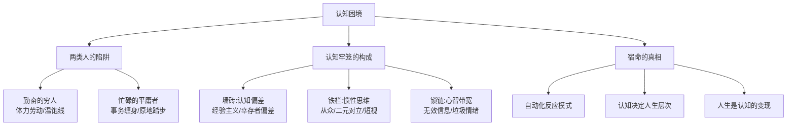
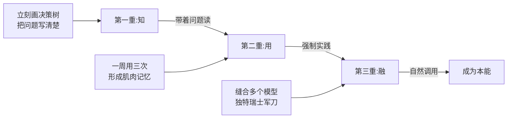

# 你的认知,就是你的牢笼与宿命

> 作者:月见 | 2025-10-27 | 重庆·两江新区

---

## 🎯 核心主题


---

## 📊 三卷修炼体系全景图

| 卷别 | 模型范围 | 核心能力 | 解决问题 | 关键词 |
|------|----------|----------|----------|--------|
| **第一卷:根基篇** | 001-022 | 学习力<br/>执行力<br/>复盘力 | 学不动<br/>做不到<br/>不长进 | 🛠️ **生存的功夫** |
| **第二卷:洞察篇** | 023-067 | 思考力<br/>沟通力<br/>规划力<br/>领导力<br/>情绪力<br/>决策力 | 从"看山是山"<br/>到"看山不是山" | 🔍 **破局的智慧** |
| **第三卷:成就篇** | 068-108 | 营销力<br/>自识力<br/>整合力<br/>故事力<br/>共情力<br/>财富力 | 从认知优势<br/>到现实成果 | 🚀 **成事的密码** |

---

## 🎴 关键概念卡片

### 💡 思维模型 = 认知重装的"压缩算法"
```
┌─────────────────────────────────────┐
│  没有模型的人               掌握模型的人  │
├─────────────────────────────────────┤
│  平面、混沌、被动           立体、清晰、主动 │
│                                         │
│  🚫 困在认知牢笼             🔓 获得认知眼镜 │
│                                         │
│  └─ 第一性原理眼镜 → 直达问题核心      │
│  └─ 金字塔原理眼镜 → 搭建清晰逻辑      │
│  └─ 复利思维眼镜   → 看见长期价值      │
│  └─ 系统思维眼镜   → 理解复杂关系      │
└─────────────────────────────────────┘
```

### 🔐 认知牢笼的三层结构
```
╔═══════════════════════════════════╗
║         你的思维模式牢笼            ║
╠═══════════════════════════════════╣
║  🧱 墙砖 → 认知偏差                ║
║     • "我吃的盐比你走的路都多"      ║
║     • "别人都过得比我好"            ║
║     • "我都懂了"(达克效应)          ║
║                                   ║
║  🚧 铁栏 → 惯性思维                ║
║     • 别人怎么做我就怎么做          ║
║     • 非黑即白的二元对立            ║
║     • 只看眼前不看长远              ║
║                                   ║
║  ⛓️ 锁链 → 心智带宽不足            ║
║     • 无效信息填满大脑              ║
║     • 被垃圾情绪占据                ║
║     • 琐碎事务消耗精力              ║
╚═══════════════════════════════════╝
```

---

## 🎯 修炼心法:从"知"到"用"再到"融"


### 📝 具体行动示例
```
┌──────────────────────────────────────┐
│  场景              →  应用模型           │
├──────────────────────────────────────┤
│  换工作烦恼        →  决策树模型         │
│  开会发表观点      →  PREP沟通模型       │
│  辅导孩子          →  GROW教练模型       │
│  分析效率低        →  PDCA复盘法         │
│  复杂项目管理      →  第一性原理         │
│                       + WBS工作分解      │
│                       + 甘特图           │
│                       + SCQA模型         │
└──────────────────────────────────────┘
```

---

## ⚡ 核心洞察金句

> **"你的认知,曾是你的牢笼。但从你翻开下一页开始,它可以是你的方舟。"**
```
╔════════════════════════════════════════╗
║  你缺的不是:                            ║
║  ❌ 机会                                ║
║  ❌ 资源                                ║
║  ❌ 运气                                ║
║                                        ║
║  你缺的是:                              ║
║  ✅ 对世界底层逻辑的根本认知            ║
╚════════════════════════════════════════╝

╔════════════════════════════════════════╗
║  宿命 = 面对同一件事时                  ║
║        一次又一次做出的                  ║
║        可被预判的                        ║
║        低水平的                          ║
║        自动化反应                        ║
╚════════════════════════════════════════╝

╔════════════════════════════════════════╗
║  你赚不到认知之外的钱                   ║
║  你过不上认知之外的生活                 ║
║                                        ║
║  → 你的人生 = 你认知的变现              ║
╚════════════════════════════════════════╝
```

---

## 🎬 行动建议
不要"看" → 要"用"
不要"收藏" → 要"行动"
这不是一本用来灌鸡汤的书
这是一把用来砸碎牢笼的锤子
108把钥匙已经放在这里
但牢门必须由你亲手打开
突围必须由你亲自冲锋
---

## 💭 Kevin,我的观察

这篇序言的结构非常清晰,作者用**对比**、**隐喻**和**递进逻辑**构建了一个完整的认知升级框架。几个值得注意的点:

1. **叙事策略**:从具体人物(老李/Amy)→抽象概念(认知牢笼)→解决方案(思维模型)→行动框架(三卷体系),层层递进

2. **心理学钩子**:开篇的"两类人"设定精准击中读者痛点——要么是"勤奋的穷人",要么是"忙碌的平庸者",很难有人不对号入座

3. **产品化思维**:108个模型 × 3卷体系,既有"大而全"的震撼感,又有"循序渐进"的可操作性

4. **关键张力**:在"困境描述"和"解决方案"之间制造了足够的张力,让人产生"我必须改变"的紧迫感

你觉得这套思维模型体系对你当前的职业转型和内容创作有什么启发?特别是在"认知变现"这个命题上?